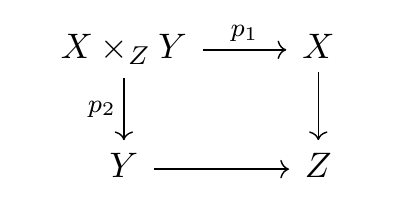

# jsx-tikzcd

Render `tikzcd` diagrams with JSX. This is a work in progress.

## Introduction

`tikzcd` is a powerful LaTeX package that can draw beautiful diagrams used in mathematics, especially category theory. However, its syntax is primarily based on the appearance, not the semantics, which makes it difficult to, say, change the position of a single node without having to redefine the edges.

`jsx-tikzcd` can turn a simple, semantic JSX tree consisting of nodes and edges into `tikzcd` code. The following JSX

~~~js
// JSX code

<Diagram>
    <Node key="prod" position={[0, 0]} value="X\times_Z Y" />
    <Node key="a" position={[1, 0]} value="X" />
    <Node key="b" position={[0, 1]} value="Y" />
    <Node key="base" position={[1, 1]} value="Z" />

    <Edge from="a" to="base" />
    <Edge from="b" to="base" />
    <Edge from="prod" to="a" value="p_1" />
    <Edge from="prod" to="b" value="p_2" alt />
</Diagram>
~~~

yields

~~~latex
% LaTeX code

\begin{tikzcd}
X\times_Z Y \arrow[r, "p_1"] \arrow[d, "p_2"'] & X \arrow[d] \\
Y \arrow[r] & Z
\end{tikzcd}
~~~

which renders into

## Installation

You can install jsx-tikzcd using npm:

~~~
npm install jsx-tikzcd
~~~
